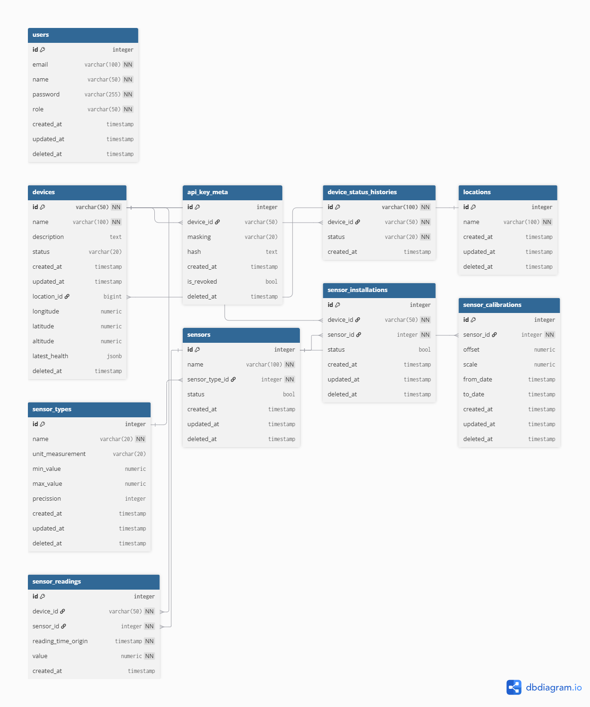

# Weather Monitoring

## Cara Menjalankan

### Opsi 1: Docker Compose (disarankan)
```bash
docker compose up --build
```
- Frontend: http://localhost:3000
- Backend: http://localhost:8080
- Seeder jalan otomatis (`WITH_SEED=true`, idempotent). Matikan via `WITH_SEED=false`.

### Opsi 2: Manual
```bash
# Backend (butuh PostgreSQL + .env, lihat backend/.env.example)
cd backend
go run ./cmd                 # tambah --with-seed untuk seeding

# Frontend
cd frontend
cp .env.example .env.local   # sesuaikan NEXT_PUBLIC_API_URL bila perlu
npm install
npm run dev                  # http://localhost:3000
```

## Dokumentasi API
- Swagger UI: http://localhost:8080/swagger/ (index), spec: `/swagger/doc.json`
- File spec: `backend/docs/swagger.json`, `backend/docs/swagger.yaml`
- Regenerasi setelah ubah anotasi (dari folder `backend`):
  ```bash
  go install github.com/swaggo/swag/cmd/swag@v1.16.6
  swag init -g cmd/main.go
  ```

## ERD

Sumber & versi interaktif: https://dbdocs.io/alir-retno/weather_monitoring

# Checklist API
- [x] Ingestion
  - [x] POST /api/v1/ingest/heartbeat (API key)
  - [x] POST /api/v1/ingest/telemetry (API key)
  - [x] POST /api/v1/ingest/telemetry/batch (API key)
- [x] Device Management
  - [x] GET /api/v1/devices (paginated, filter, search, sort)
  - [x] POST /api/v1/devices
  - [x] GET /api/v1/devices/{id}
  - [x] PATCH /api/v1/devices/{id}
  - [x] DELETE /api/v1/devices/{id} (soft delete)
  - [x] POST /api/v1/devices/{id}/credentials/rotate
  - [x] GET /api/v1/devices/{id}/credentials
  - [x] GET /api/v1/devices/{id}/health (histori status)
  - [x] POST /api/v1/devices/{device_id}/sensors/{sensor_id} (instalasi)
  - [x] DELETE /api/v1/devices/{device_id}/sensors/{sensor_id} (uninstall)
  - [x] GET /api/v1/installations/{id}
- [x] Sensor Management
  - [x] GET /api/v1/sensor-types
  - [x] POST /api/v1/sensor-types
  - [x] GET /api/v1/sensors
  - [x] POST /api/v1/sensors
  - [x] GET /api/v1/sensors/{id}
  - [x] PATCH /api/v1/sensors/{id}
  - [x] DELETE /api/v1/sensors/{id} (soft delete)
  - [x] GET /api/v1/sensors/{id}/calibrations
  - [x] POST /api/v1/sensors/{id}/calibrations
- [x] Dashboard & Readings
  - [x] GET /api/v1/readings (raw + agregasi 1m/1h/1d)
- [x] Auth & Lokasi
  - [x] POST /api/v1/login (JWT)
  - [x] GET /api/v1/locations
  - [x] GET /api/v1/locations/{id}
  - [x] POST /api/v1/locations
- [x] Sistem
  - [x] GET /health
  - [x] GET /swagger/ (dokumentasi API)

# Checklist Frontend
- [x] Login
- [ ] Dashboard
- [x] Device Management
- [ ] Sensor Management
- [ ] User Management

# Checklist Penyelesaian
- [x] Repository Git dengan commit history
- [x] README.md (setup, arsitektur, keputusan desain, yang belum selesai)
- [ ] JAWABAN.md (esai bagian 5 + pertanyaan desain di bagian A, B, C, D, E,G)
- [x] ERD (gambar + file sumber)
- [ ] Diagram alur data
- [x] Dokumentasi API (OpenAPI atau API.md ) + contoh JSON bagian F
- [x] docker-compose.yml + .env.example — teruji docker compose up
- [x] File migrasi database (Gorm AutoMigrate)
- [x] Seeder + data historis 7 hari (data historis belum)
- [ ] Device simulator
- [ ] Unit test untuk 4 logika di bagian 4.5
- [x] Frontend Next/Nuxt berjalan dan terhubung ke API (sebagian besar belum selesai)